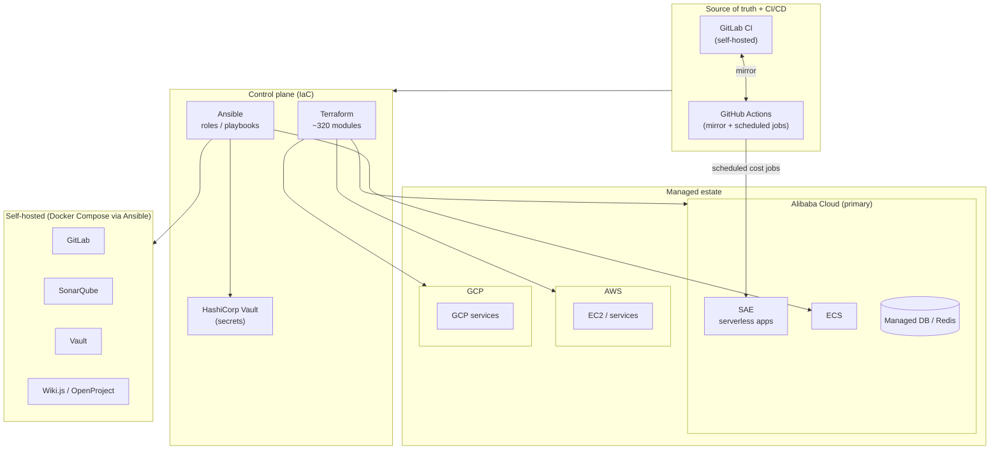
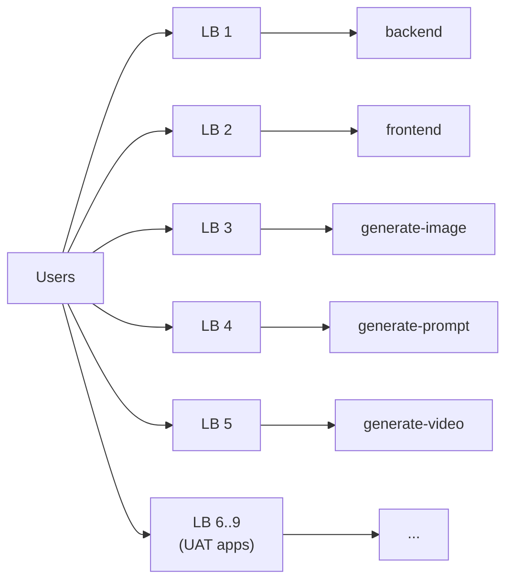
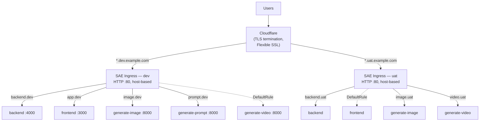
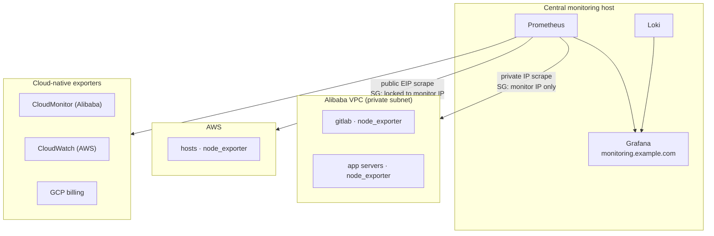
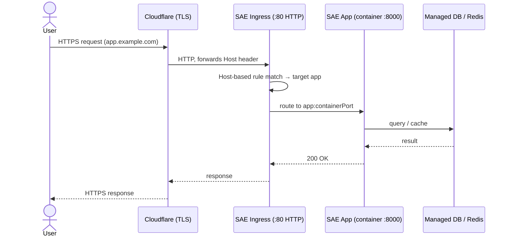

# Architecture Diagrams

Sanitized diagrams of the multi-cloud platform. Written in [Mermaid](https://mermaid.js.org/) —
they render natively on GitHub/GitLab and on most static-site generators
(or paste into <https://mermaid.live> to export PNG/SVG for a portfolio site).

Company names, public IPs, resource IDs, and domains are placeholders;
topology and decisions are real.

---

## 1. Multi-cloud platform — control plane & estate

How code becomes infrastructure across three clouds and the self-hosted stack.



---

## 2. Load-balancer consolidation — before vs. after

The FinOps win: 9 dedicated load balancers collapsed into 1 host-routing Ingress
per environment (~75% cost cut). See
[case study 01](./01-cost-optimization-clb-consolidation.md).

### Before — one load balancer per app (9 billable LBs)



### After — Cloudflare TLS + 1 Ingress per environment (2 LBs total)



---

## 3. Centralized observability — scrape topology

Security-aware metrics collection: private-VPC scraping on Alibaba, IP-locked
public scraping on AWS. See [case study 04](./04-observability-fleet-monitoring.md).



---

## 4. Production request flow (Alibaba SAE)

End-to-end path of a user request in the consolidated architecture.



---

## Exporting for a portfolio site

- **GitHub/GitLab:** these render automatically in Markdown — no setup.
- **PNG/SVG:** paste a block into <https://mermaid.live>, export, embed the image.
- **Static sites (Hugo, Astro, Docusaurus, MkDocs Material):** all support
  Mermaid via a plugin/shortcode — drop the fenced ` ```mermaid ` blocks in.
