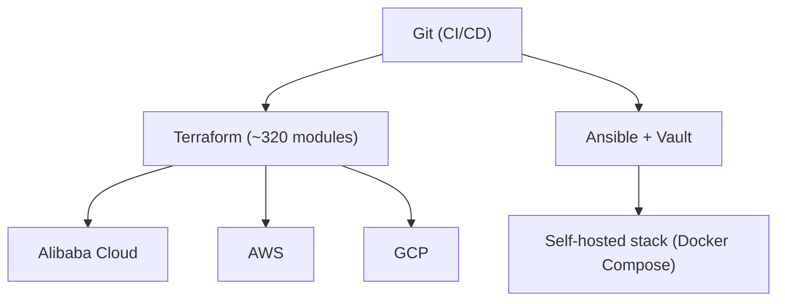
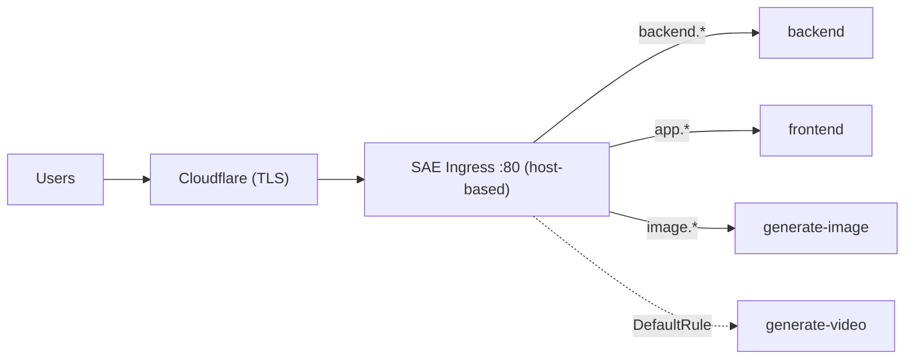
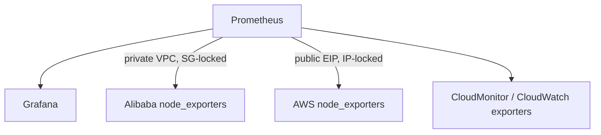

# Architecture

Sanitized diagrams (Mermaid — render natively on GitHub).

## Control plane: code → infrastructure

## Request flow (consolidated ingress)

## Observability scrape topology

> Full write-ups (problem → approach → impact) live with my portfolio case
> studies.
